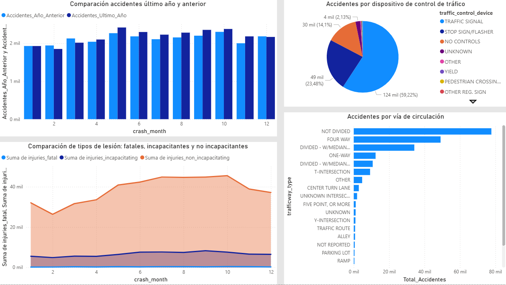

# 🚦 Traffic Accident Analysis — Power BI Dashboard

This project consists of developing an **interactive Power BI dashboard** to analyze traffic accident data.  
The main goal is to better understand **how, when, and why** accidents occur, allowing the identification of relevant patterns and supporting decision-making to improve road safety.

---

## 🎯 Analysis Objectives

The dashboard focuses on answering several key questions:

1. **In which months do the most accidents occur?**  
   Helps identify seasonality or high-risk periods.

2. **How are accidents distributed throughout the day?**  
   Highlights whether there are particularly critical time ranges.

3. **What is the economic impact of accidents?**  
   Examines the total cost associated with traffic incidents.

4. **What are the most frequent causes of accidents?**  
   Useful for guiding prevention strategies.

5. **Year-to-year comparison:** Are accidents increasing or decreasing?  
   Allows the detection of long-term trends.

6. **Traffic control devices:**  
   Analyzes whether their presence is related to the reduction or occurrence of accidents.

7. **Road types and associated risk levels:**  
   Identifies which areas or road types require additional preventive action.

8. **Severity of accidents:**  
   Proportion of accidents resulting in minor injuries, serious injuries, or fatalities.

---

## 🧠 Technologies Used

| Tool | Purpose |
|------|---------|
| **Power BI** | Dashboard creation and data visualization |
| **Power Query** | Data cleaning and transformation |
| **DAX** | Custom metric and measure calculations |
| **Excel** | Original data source |

---

## 🖼️ Dashboard Preview

| Page 1 | Page 2 |
|-------|--------|
|  |  |

---

## 🚀 How to Open the Project

1. Download the file `PowerBI_Traffic_Accidents_Dashboard.pbix`.
2. Open it using **Power BI Desktop**.

---

## 🧑‍💻 Author

**Hugo Crespo**

## 📂 Contenido del Repositorio

